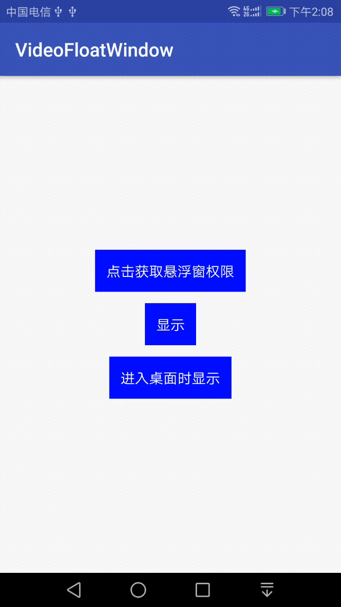

### 声明
本项目是基于一个[开源项目](https://github.com/yhaolpz/FloatWindow) 的源码改造而来，因为作者已经不维护了，并且功能实现和视频悬浮窗有一定的差别，我另开了一个项目，并删除修改了部分源码，
但是项目文件的文件头中，仍然保留原作者的信息：
```
/**
 * Created by yhao on 2017/12/22.
 * https://github.com/yhaolpz
 */
```

---
### 引用
> https://github.com/ilpanda/VideoFloatWindow 


---
### 前言
最近视频直播比较火,项目需要一个视频播放悬浮窗功能,产品经理要求实现虎牙的悬浮窗。

分析下需求，视频悬浮窗功能在实现上主要有以下几个特点：

1. 悬浮：可以悬浮在所有页面之上，并且当退出到桌面的时候，也能悬浮。
2. 滑动：手指按着悬浮窗，手指移动的时候，悬浮窗可以跟着手指移动。
3. 其他交互：单击进入视频直播页面，双击可以缩放悬浮窗，在某些页面上隐藏和显示。

需求分析完了，再来分析具体技术上的实现思路：
1. 悬浮：悬浮窗功能需要添加权限，并且需要跳转到设置界面，用户点击授权后才能正常显示。：
```
    <!--悬浮窗权限-->
    <uses-permission android:name="android.permission.SYSTEM_ALERT_WINDOW" />
```
<font color=red>如果用户没有授权，直接显示悬浮窗，会直接崩溃。因此这里务必要小心、谨慎</font>

同时由于国内手机类型众多，跳转到授权界面需要兼容适配。

2. 滑动：熟悉 View 触摸事件的同学一定都知道，想要实现一个 View 随着手指的滑动而滑动很简单，重写 View 的 onTouchEvent 或者设置 onTouchListener 即可。但是要实现一个 View 不仅能随着 View 滑动，
并且还能响应单击和双击事件则比较麻烦。我们知道原生 View 的点击事件是在 ACTION_UP 中触发的，自己实现 onTouchEvent 意味着要自己实现单击事件。因此我们可以借助 GestureDetector 来实现滑动、单击和双击事件的监听。


---
### 说明
悬浮窗默认的范围被限制在状态栏以下，虚拟导航栏以上。

如果需要在状态栏也显示，需要将初始的 y 值设置为 -statusBarHeight，同时将 topMargin 设置为 -statusBarHeight。


---
### 实现效果



---
### 最后

